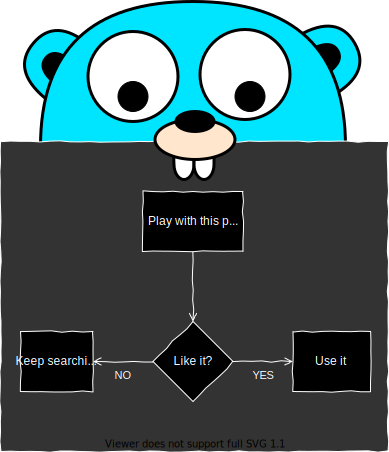

# Go Draw - Golang mxGraph (draw.io) types

This package provides types and helper functions to do some basic but useful things with [mxGraph](https://github.com/jgraph/mxgraph) diagrams in XML, which is most famously used by [app.diagrams.net](https://app.diagrams.net), the new name of [draw.io](https://draw.io).

## License

Check out the [LICENSE](https://raw.githubusercontent.com/pauloqueiroga/godraw/main/LICENSE) file at the root folder of this repository. If you're reading this text from some other source that is not through the Git repository itself, the repository lives in [github.com/pauloqueiroga/godraw](https://github.com/pauloqueiroga/godraw).

## Contributing

The package as it is fulfills all of my current needs, but it's not completely done. Feel free to create Pull Requests with any improvements and additions you'd like to see in this package.

  

  

